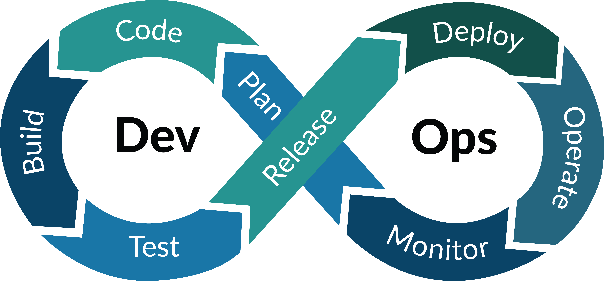

# What is DevOps

DevOps is a set of practices and tools that integrates software development (Dev) and operations (Ops) together to improve software development lifecycle by shortening the feedback loop. Another variant is called DevSecOps wherein security is embedded at each stage of the development and release cycle.

DevOps is complementary to agile software development and several DevOps principle came from agile ways of working.

# DevOps ToolChain

A collection of tools categorized in different stages of the DevOps infinity loop.

> [!NOTE]
> - List is not exhaustive and will continue to evolve over time
> - Open-source is prioritized
> - Much like *there's more than one way to skin a cat*, no tool is perfect for everything
> - Due to the nature of software development, tools mentioned here might become obsolete or replaced by superior ones

## Plan and Code

| **Category**                              | **Tools**                                                                                                                                                                                                                                                                                                                                                    |
| ----------------------------------------- | ------------------------------------------------------------------------------------------------------------------------------------------------------------------------------------------------------------------------------------------------------------------------------------------------------------------------------------------------------------ |
| Collaboration                             | <ul><li>[Confluence](https://www.atlassian.com/software/confluence)</li><li>[Jira](https://www.atlassian.com/software/jira)</li><li>[MS Teams](https://teams.microsoft.com/)</li><li>[OneDrive](https://onedrive.com/)</li><li>[SharePoint](https://www.microsoft.com/en-us/microsoft-365/sharepoint/collaboration)</li><li>[Slack](https://slack.com)</li></ul>                                                                                                                                                                                                                                                 |
| Documentation and Diagrams                | <ul><li>[Confluence](https://www.atlassian.com/software/confluence)</li><li>[Markdown](https://daringfireball.net/projects/markdown/)</li><li>[Drawio](https://github.com/jgraph/drawio-desktop)</li><li>[Mermaid](https://github.com/mermaid-js/mermaid)</li><li>[PlantUML](https://github.com/plantuml/plantuml)</li><li>[OpenAPI Specification](https://github.com/OAI/OpenAPI-Specification)</li></ul>                                                                                                                                   |
| Languages                                 | <ul><li>[Java](https://www.oracle.com/java/)</li><li>[Python](https://www.python.org/)</li><li>[Bash](https://git.savannah.gnu.org/cgit/bash.git)</li><li>[Terraform](https://github.com/hashicorp/terraform)</li><li>[Ansible](https://github.com/ansible/ansible)</li><li>[Go](https://github.com/golang/go)</li><li>[Lua](https://www.lua.org/)</li><li>[Ruby](https://www.ruby-lang.org/en/)</li><li>[JavaScript](https://ecma-international.org/publications-and-standards/standards/ecma-262/)</li><li>[PHP](https://www.php.net/)</li><li>[C](https://www.open-std.org/jtc1/sc22/wg14/)/[C++](https://isocpp.org/)</li><li>[Scala](https://www.scala-lang.org/)</li></ul> |
| Version Control ([Git](https://git-scm.com/)) Platforms           | <ul><li>[GitLab](https://gitlab.com/)</li><li>[GitHub](https://github.com)</li><li>[Bitbucket](https://bitbucket.org/)</li></ul>                                                                                                                                                                                                              |
| Secure Coding                             | <ul><li>[SonarQube](https://github.com/SonarSource/sonarqube)</li><li>[Black Duck](https://www.synopsys.com/software-integrity/software-composition-analysis-tools/black-duck-sca.html)</li><li>[JFrog Xray](https://jfrog.com/solution-sheet/jfrog-xray/)</li><li>[Zap](https://github.com/zaproxy/zaproxy)</li></ul>                                                                                                                                               |
| Threat-Modeling and Risk-Assessment-Model | <ul><li>[STRIDE](https://en.wikipedia.org/wiki/STRIDE_(security))</li><li>[DREAD](https://en.wikipedia.org/wiki/DREAD_(risk_assessment_model))</li></ul>                                                                                                                                                                                                     |
| IDE and ID Security Plugins               | <ul><li>[VS-Code](https://github.com/microsoft/vscode)</li><li>[Intellij IDEA](https://github.com/JetBrains/intellij-community)</li></ul>                                                                                                                                                                                                                    |
| Pre-commit Hooks                          | <ul><li>[pre-commit-terraform](https://github.com/antonbabenko/pre-commit-terraform)</li><li>[pre-commit](https://pre-commit.com/)</li></ul>                                                                                                                                                                                                                 |
| Static Application Security Testing       | <ul><li>[SonarQube](https://github.com/SonarSource/sonarqube)</li></ul>                                                                                                                                                                                                                                                                                                                                                           |

## Build and Test

| **Category**              | **Tools**                                                                                                                                                                                                                                                                                              |
| ------------------------- | ------------------------------------------------------------------------------------------------------------------------------------------------------------------------------------------------------------------------------------------------------------------------------------------------------ |
| Continuous Integration    | <ul><li>[Jenkins](https://github.com/jenkinsci/jenkins)</li><li>[GitLab](https://about.gitlab.com/)</li><li>[Docker](https://www.docker.com/)</li><li>[GitHub Actions](https://github.com/features/actions)</li><li>[Podman](https://podman.io/)</li></ul>                                                                                  |
| Registries                | <ul><li>[Docker Hub](https://hub.docker.com/)</li><li>[Artifactory](https://jfrog.com/artifactory/)</li><li>[Nexus](https://github.com/sonatype/nexus-public)</li></ul>                                                                                                                                                                            |
| Secure Pipelines          | <ul><li>[StackStorm](https://github.com/StackStorm/st2)</li></ul>                                                                                                                                                                                                                                                                                                     |
| Infrastructure Scanning   | --                                                                                                                                                                                                                                                                                                     |
| Secure Acceptance Testing | --                                                                                                                                                                                                                                                                                                     |
| Unit and Function Testing | <ul><li>[Postman](https://www.postman.com/)</li><li>[JUnit](https://github.com/junit-team/junit5)</li><li>[Thunder client](https://github.com/rangav/thunder-client-support)</li></ul>                                                                                                                 |
| Performance Testing       | <ul><li>[JMeter](https://github.com/apache/jmeter)</li><li>[Locust](https://github.com/locustio/locust)</li><li>[Chaos Mesh](https://github.com/chaos-mesh/chaos-mesh)</li><li>[Grafana K6](https://github.com/grafana/k6)</li></ul>                                                                   |
| End to end Testing        | <ul><li>[Cucumber](https://github.com/cucumber)</li><li>[Nightwatch](https://github.com/nightwatchjs/nightwatch)</li></ul>                                                                                                                                                                                                                                                                |
| Infrastructure-as-Code    | <ul><li>[Terraform](https://github.com/hashicorp/terraform)</li><li>[Ansible](https://github.com/ansible/ansible)</li><li>[Crossplane](https://github.com/crossplane/crossplane)</li><li>[Pulumi](https://github.com/pulumi/pulumi)</li><li>[OpenTofu](https://github.com/opentofu/opentofu)</li></ul> |
| Container Orchestration   | <ul><li>[Kubernetes](https://github.com/kubernetes/kubernetes)</li><li>[OpenShift](https://github.com/openshift)</li></ul>                                                                                                                                                                             |

## Release and Deploy

| **Category**         | **Tools**                                                                                                                                                                                                                                                                                                                                  |
| -------------------- | ------------------------------------------------------------------------------------------------------------------------------------------------------------------------------------------------------------------------------------------------------------------------------------------------------------------------------------------ |
| Continuous Delivery  | <ul><li>[Jenkins](https://github.com/jenkinsci)</li><li>[GitLab](https://about.gitlab.com/)</li><li>[GitHub Actions](https://github.com/features/actions)</li><li>[FluxCD](https://github.com/fluxcd/flux2)</li><li>[ArgoCD](https://github.com/argoproj/argo-cd)</li><li>[Crossplane](https://github.com/crossplane/crossplane)</li></ul> |
| Cloud Platform       | <ul><li>[GCP](https://cloud.google.com/gcp/)</li><li>[AWS](https://aws.amazon.com)</li><li>[Azure](https://azure.microsoft.com/)</li></ul>                                                                                                                                                                                                 |
| Security Smoke Test  | --                                                                                                                                                                                                                                                                                                                                         |
| Configuration Checks | --                                                                                                                                                                                                                                                                                                                                         |

## Operate and Monitor

| **Category**          | **Tools**                                                                                                                                                                                                                                                                                                       |
| --------------------- | --------------------------------------------------------------------------------------------------------------------------------------------------------------------------------------------------------------------------------------------------------------------------------------------------------------- |
| Monitoring            | <ul><li>[Prometheus](https://github.com/prometheus/prometheus)</li><li>[Grafana](https://github.com/grafana/grafana)</li><li>[Grafana Loki](https://github.com/grafana/loki)</li><li>[Elastic Stack](https://www.elastic.co/elastic-stack/)</li><li>[Jaeger](https://github.com/jaegertracing/jaeger)</li><li>[K9s](https://github.com/derailed/k9s)</li><li>[Zabbix](https://github.com/zabbix/zabbix)</li></ul> |
| Threat Intelligence   | --                                                                                                                                                                                                                                                                                                              |
| Penetration Testing   | <ul><li>[Hashcat](https://github.com/hashcat/hashcat)</li><li>[Wireshark](https://github.com/wireshark/wireshark)</li><li>[John the Ripper](https://github.com/openwall/john)</li><li>[Hydra](https://github.com/vanhauser-thc/thc-hydra)</li><li>[Burp Suite](https://portswigger.net/burp)</li><li>[Nmap](https://github.com/nmap/nmap)</li><li>[Ligolo-ng](https://github.com/nicocha30/ligolo-ng)</li></ul>                                 |
| Blameless Postmortems | <ul><li>[Retrospective](./templates/retrospective.md)</li><li>Gather metadata about incident</li><li>Coordination and collaboration</li><li>[Root Cause Analysis](./templates/root-cause-analysis.md)</li><li>Bug in the system not bug in humans</li></ul>                                                                                                                           |