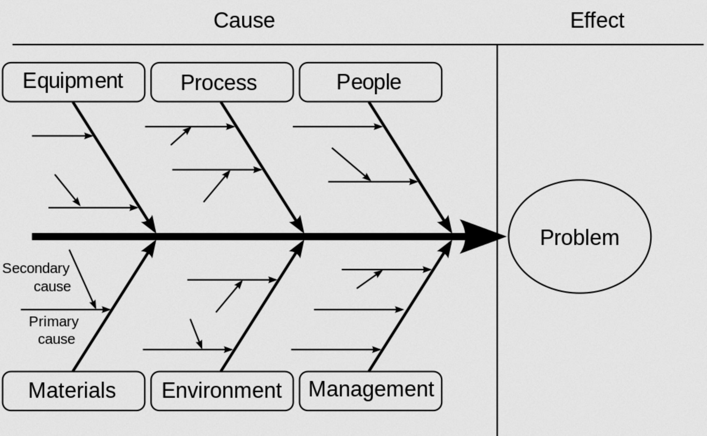

# Root Cause Analysis

Root Cause Analysis (RCA) is a problem-solving approach used to identify the underlying causes of a specific issue or problem, rather than just addressing its symptoms. The primary goal of RCA is to prevent the recurrence of similar issues in the future by understanding and fixing the root cause.

In the context of information technology, RCA may involve gathering data from various sources such as system logs, network traffic analysis, application performance monitoring, user feedback, and other relevant information. The data is then analyzed using various analytical techniques, such as trend analysis, correlation analysis, regression analysis, or failure mode and effects analysis (FMEA), to identify the root cause of a problem.

The RCA process can be broken down into several steps:
1. Identify the problem: Clearly define the issue and its impact on the system, users, or business.
2. Collect data: Gather relevant information about the problem from various sources.
3. Analyze the data: Use analytical techniques to identify trends, correlations, or patterns that may indicate the root cause.
4. Identify potential causes: Generate hypotheses about possible root causes based on the analysis of the data.
5. Test hypotheses: Validate each hypothesis by collecting additional data or performing experiments.
6. Implement corrective actions: Address the root cause and prevent similar issues from recurring in the future.
7. Monitor the system: Continuously monitor the system to ensure that the problem has been resolved and that no new issues have arisen.

## Identify Potential Causes Techniques

### Ishikawa Diagram

Ishikawa diagram or also known as fishbone diagram is a causal diagram that show potential causes of an issue.

Source: [Wikipedia](https://en.wikipedia.org/wiki/Ishikawa_diagram)

In software engineering, the following are considered high level causes of an issue:

- People
- Process
- Tools
- Program
- Environment

### 5 Why's Technique

The 5 Whys is a problem-solving technique used to identify the root cause of a specific issue by asking "Why" repeated questions. It involves continually delving deeper into the reasoning behind each answer until reaching the underlying cause, ultimately leading to effective corrective actions.

### Pareto Analysis

Pareto Analysis or the 80/20 rule is a statistical method used to prioritize issues based on their impact and frequency. It identifies the vital few causes that contribute to the majority of problems, allowing organizations to focus their resources effectively. By ranking problems based on their importance, Pareto Analysis helps in making data-driven decisions and improving overall performance.

| **High level issues** | **5 Whys**                               | **Pareto Analysis** |
| --------------------- | ---------------------------------------- | ------------------- |
| People                | Why? Why? Why? Why? Why?  | Vote                |
| Process               | Why? Why? Why? Why? Why?  | Vote                |
| Tools                 | Why? Why? Why? Why? Why?  | Vote                |
| Program               | Why? Why? Why? Why? Why?  | Vote                |
| Environment           | Why? Why? Why? Why? Why?  | Vote                |